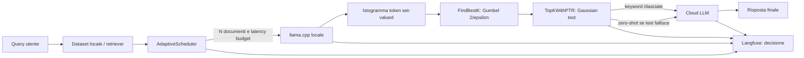

# DP-KSA con Scheduler Adattivo

Questo Proof of Concept implementa il flusso DP-KSA di Tang et al.,
*Differentially Private Retrieval-Augmented Generation*, con un contributo
aggiuntivo per la tesi: la scelta adattiva del numero di ensemble in base a
latency SLA, RTT, dimensione dei documenti e budget di privacy.

Il percorso supportato e `poc/run_pipeline.py`. Il file
`poc/poc_real_dp_ksa.py` rimane come wrapper di compatibilita; le
implementazioni monolitiche storiche sono in `poc/archive/`.

## Architettura



La spiegazione dettagliata del flusso e delle invarianti si trova in
[`poc/ARCHITECTURE.md`](poc/ARCHITECTURE.md). Le formule DP e il contratto di
composizione sono in
[`poc/docs/PRIVACY_ACCOUNTING.md`](poc/docs/PRIVACY_ACCOUNTING.md); le
integrazioni esterne sono in [`poc/docs/CONFIGURATION.md`](poc/docs/CONFIGURATION.md).

## Setup

Da una shell nella directory `poc/`:

```bash
python3 -m venv .venv
.venv/bin/python -m pip install -r requirements-dev.txt
```

`requirements.txt` contiene le dipendenze runtime. `requirements-dev.txt`
aggiunge `pytest`, `pytest-cov` e `ruff`.

Il modello Qwen GGUF viene scaricato automaticamente al primo avvio. Il
download usa un file temporaneo, verifica `Content-Length` e sostituisce il
file finale solo dopo il completamento dello stream. Un download interrotto
puo quindi essere ritentato senza cancellazione manuale.

Per usare Langfuse o un provider cloud OpenAI-compatible, da `poc/` copiare
`.env.example` in `.env` e valorizzare le variabili necessarie. Senza
`CLOUD_API_KEY`/`OPENAI_API_KEY` e senza un endpoint custom viene usata una
risposta cloud simulata. Il provider riceve solo query e parole rilasciate dal
filtro DP, mai i contesti locali.

## Esecuzione

Esecuzione riproducibile con SLA e rete simulati:

```bash
.venv/bin/python run_pipeline.py \
  --epsilon 1.0 \
  --delta 0.0001 \
  --max-latency-ms 1500 \
  --rtt-ms 50 \
  --seed 42
```

Query parametrica:

```bash
.venv/bin/python run_pipeline.py \
  --query "Who was the Super Bowl 50 MVP?" \
  --max-latency-ms 2000 \
  --rtt-ms 20
```

Parametri principali:

| Parametro | Default | Significato |
| --- | ---: | --- |
| `--ensemble-size` | `40` | Numero massimo di candidati; N effettivo e deciso dallo scheduler |
| `--epsilon` | `1.0` | Budget epsilon totale |
| `--delta` | `1e-4` | Failure probability del PTR |
| `--max-latency-ms` | `1500` | SLA end-to-end |
| `--rtt-ms` | `50` | RTT stimato verso il cloud |
| `--tempo-cloud-ms` | `150` | Latenza cloud stimata |
| `--seed` | assente | Seed opzionale del campionamento |
| `--query` | dataset | Query esplicita |
| `--cloud-base-url` | ambiente | Endpoint OpenAI-compatible |
| `--cloud-model` | ambiente | Identificativo modello cloud |
| `--model-path` | `poc/models` | Destinazione locale GGUF |
| `--model-url` | Hugging Face | URL usata per il download |
| `--langfuse-capture-sensitive` | disattivo | Opt-in per diagnostica sensibile |

Output atteso, con valori numerici variabili per l'inferenza e il rumore:

```text
Decisione Scheduler Adattivo
N=5 | sigma=... | PTR pass-rate attesa=...
Fase 1: inferenza locale sull'ensemble
Fase 2: DP-KSA FindBestK + TopKWithPTR
k_hat=... gap PTR=... passato=...
Keyword rilasciate: [...]
Epsilon consumato=...; epsilon rimasto=...
Fase 3: generazione cloud
Risposta cloud: ...
```

## Meccanismo di privacy

Per ogni risposta locale, ogni token contribuisce al massimo una volta

```text
d_k = H(k) - H(k+1)
```

La sensibilita globale di `d_k` e 2: un documento adiacente puo cambiare una
risposta, facendo aumentare un conteggio e diminuire il conteggio adiacente.

1. `FindBestK` seleziona `k_hat` con il punteggio `d_k + r(k) + Gumbel(2/e)`.
   Il regolarizzatore ammette di default solo `15 <= k <= 30`.
2. `TopKWithPTR` calcola `d_hat_k = max(2, d_k) + N(0, 4 sigma^2) -
   Phi(1-delta; 0, 2 sigma)`. Se `d_hat_k > 2`, rilascia i top-k esatti;
   altrimenti rilascia una lista vuota e la generazione finale e zero-shot.
   Per `d_k <= 2`, la probabilità analitica del failure release e `delta`.
3. I costi RDP dei due meccanismi sono sommati per ogni ordine e convertiti
   in `(epsilon, delta)-DP` tramite il bound del Teorema A.6.

Il filtro espone `budget_consumato_epsilon`, `budget_consumato_delta` e
`epsilon_rimasto`. Questi valori sono cumulativi per la vita dell'istanza:
le componenti RDP vengono sommate per ordine prima della conversione e una
chiamata successiva che supera il budget solleva `DPBudgetExhaustedError`.
Per richieste indipendenti si crea una nuova istanza. Il `strict_gap_guard` e
disattivo di default per mantenere esattamente il meccanismo formale del
paper; se abilitato, richiede una valutazione separata della prova.

## Scheduler

Per ogni documento lo scheduler stima:

```text
t_i = token_i / throughput_prefill + max_tokens / throughput_generation
t_residuo = SLA - RTT - tempo_cloud
```

Conta quante inferenze sequenziali entrano nel tempo residuo e applica il
clamp operativo `[N_MIN, N_MAX] = [5, 40]`, limitato ai documenti disponibili.
L'epsilon viene diviso 50/50 tra `FindBestK` e `TopKWithPTR`; `sigma` viene
derivata invertendo `epsilon_RDP = alpha / (2 sigma^2)` su un ordine
compatibile con il budget composto. Il pass-rate mostrato e una stima di
planning: usa la formula PTR per un gap rappresentativo pari a 3 e una
correzione empirica 50/50, non sostituisce l'accounting formale.

## Test e qualita

```bash
.venv/bin/python -m pytest -v
.venv/bin/python -m coverage erase
.venv/bin/python -m coverage run -m pytest -q tests/test_scheduler.py -p no:cov
.venv/bin/python -m coverage report -m
.venv/bin/python -m ruff check .
```

La suite include test statistici sul Gumbel (10.000 campioni), formula
analitica PTR e casi stabile/zero-shot, composizione cumulativa del budget,
persistenza RNG, policy Langfuse redatta/opt-in, campionamento casuale e seed,
scheduler su rete lenta/veloce, integrazione DatasetLoader-scheduler-filtro e
cleanup del file parziale del modello.

## Struttura

```text
poc/core/
  privacy.py    FindBestK, TopKWithPTR, RDP accounting
  scheduler.py  scelta adattiva di N e sigma
  dataset.py    caricamento e campionamento benchmark
  engine.py     download atomico e inferenza llama.cpp
  cloud.py      adapter OpenAI-compatible o simulazione offline
  telemetry.py  tracing Langfuse opzionale
poc/run_pipeline.py
poc/docs/
  PRIVACY_ACCOUNTING.md  formule PTR, RDP e composizione cumulativa
  CONFIGURATION.md       modello, provider cloud e telemetria
poc/tests/
poc/archive/
```
