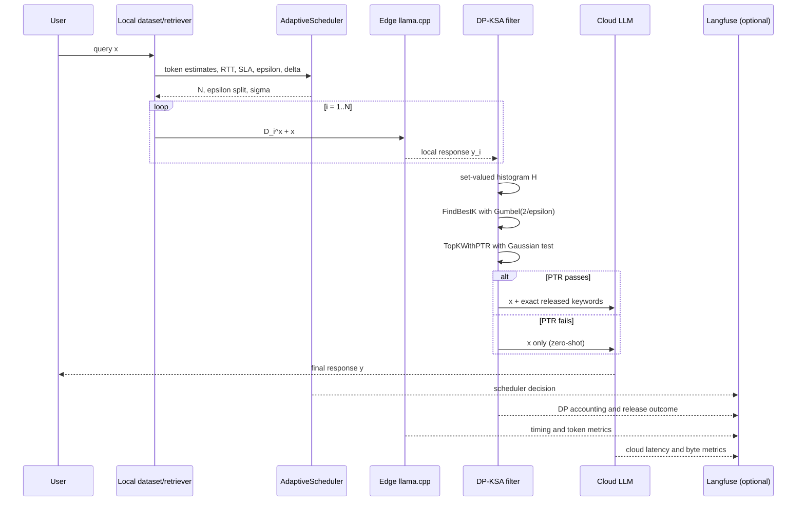

# Architecture And Privacy Accounting

## Runtime flow



## Module responsibilities

### `core.dataset`

`DatasetLoader` validates the local JSON and constructs immutable
`DocumentoBenchmark` records. `ottieni_campione_ensemble()` uses sampling
without replacement. A supplied seed is used only for reproducible benchmark
runs; an omitted seed uses fresh system entropy on every invocation.

### `core.scheduler`

`AdaptiveScheduler` is deliberately independent of the model implementation.
It receives token estimates and measured throughput instead of guessing model
latency from document count alone. Local inference is modeled as sequential,
because the current PoC invokes `llama.cpp` serially. If the SLA cannot fit
`N_MIN`, the scheduler still returns `N_MIN` and records the infeasible SLA in
the motivation string rather than silently reducing statistical redundancy.

The scheduler never spends more than the requested epsilon allocation. A
`PrivacyBudgetExhaustedError` is raised if the RDP conversion grid cannot
produce a positive PTR budget.

### `core.privacy`

The histogram is set-valued: repeated occurrences of a word in one response
do not increase its count. This is essential for the sensitivity argument.

For adjacent private databases, the retrieved sets differ in at most one
document and therefore one local response. The utility
`d_k = H(k) - H(k+1)` has global sensitivity 2. `FindBestK` implements the
exponential mechanism through centered Gumbel perturbations with scale
`2 / epsilon_find_best_k`.

`TopKWithPTR` follows Algorithm 2. Its Gaussian sample has standard deviation
`2 sigma`, and the quantile correction is computed with
`NormalDist().inv_cdf(1-delta)`. Exact top-k tokens are released only after
the test passes. For raw gap `g`, the analytical pass probability is
`1 - Phi((tau + 2 - max(2, g)) / (2 sigma))`; for `g <= 2` it is exactly
`delta`. The optional strict gap guard is disabled in the formal default,
because it is an additional operational policy not present in Algorithm 2.

For each RDP order `alpha`, the account is:

```text
epsilon_total_RDP(alpha)
  = epsilon_EM(alpha) + alpha / (2 sigma^2)
```

The implementation evaluates Theorem A.9 for `epsilon_EM(alpha)` and then
minimizes:

```text
epsilon_DP = epsilon_total_RDP(alpha)
              + log(1 / delta_conversion) / (alpha - 1)
```

The result object exposes both the selected order and the two component RDP
losses, making the thesis experiments auditable. Repeated calls on one
`DP_KSA_Filter` multiply both per-call RDP components by the invocation count
and add the PTR failure probabilities with a union bound before conversion.
An over-budget next call raises `DPBudgetExhaustedError`; independent requests
must use independent filter instances.

### `core.engine`

Model provisioning writes to a unique `.part` file in the target directory,
checks the HTTP byte count, flushes and fsyncs it, and atomically replaces the
destination. The `finally` cleanup removes a partial artifact after network,
filesystem, or integrity errors. This also supports a bare filename such as
`model.gguf` in the current directory.

The prefill metric is explicitly named `tempo_prefill_stimato_sec`. It is an
estimate based on the measured total duration and the configured
`PREFILL_GENERATION_RATIO`, not a direct llama.cpp phase measurement.

### `core.cloud`

Only the question and released keywords are sent to the configured
OpenAI-compatible endpoint. Raw contexts are used locally only to calculate a
comparison byte count. Without credentials or a custom endpoint, the adapter
returns a deterministic simulated response for offline tests. Provider errors
are logged with details but returned to callers as a generic structured error.

### `core.telemetry`

Langfuse is optional and can point to a self-hosted endpoint. Redacted tracing
is the default: queries, drafts, raw counts, discarded tokens, and final
responses are omitted. `LANGFUSE_CAPTURE_SENSITIVE=true` opts into those
payloads for a trusted local deployment. Connection and URL errors are logged
and tracing is disabled or closed without changing the privacy decision or
cloud response.

## Privacy boundary and assumptions

The formal guarantee applies to the private retrieval database under the
paper's assumptions: the retriever changes by at most one document between
adjacent databases, retrieved documents are partitioned into disjoint local
responses, and the final cloud generation is post-processing of the released
keywords and the public query. The generator's pretraining data is outside
this guarantee.

The adaptive choice of `N` is made from public operational signals supplied
to the scheduler. If an implementation derives scheduler inputs from private
document content, that decision must itself be included in the privacy
accounting.
