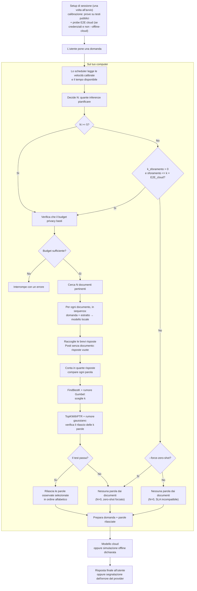

# Schema a blocchi del sistema

Il diagramma descrive il funzionamento attuale della modalità adattiva. **N** è il numero di inferenze locali pianificate; **k** è il numero di parole proposte al filtro. La calibrazione automatica delle velocità è implementata e attivata di default all'avvio della sessione. La soglia di sforamento accettabile (A2) è implementata: con `k_sforamento > 0` lo scheduler può pianificare N=5 anche se lo SLA stimato non basta, se lo sforamento previsto rientra in `k × E2E_cloud_ms`. Il flag `--force-zero-shot` forza N=0. Il probe cloud E2E (A1) misura `E2E_cloud_ms` con una sola generazione pubblica di sessione e lo alimenta alla tolleranza A2 (con `--offline-cloud` o senza credenziali la misura viene saltata e si usa la stima manuale `RTT + tempo_cloud_ms`). Dopo la risposta cloud, l'euristica A3 (`core/etichette.py`) classifica l'esito come `insufficienti`, `errore`, `completo` o `degradato`, con variante stretta per ticket via `riferimenti_ticket`; disattivabile con `--no-etichette`. La telemetria hardware A5 (`core/telemetry_hw.py`) misura temperatura CPU/GPU, util, RAM, VRAM, Watt e memory pressure prima/dopo ogni run, e campiona durante la run con `--hw-sample-period N`.

## Come leggere il percorso

1. **La domanda avvia il lavoro.** I documenti provengono dai percorsi locali esplicitamente indicati oppure dal benchmark previsto. Il programma non cerca liberamente nei file personali.
2. **Lo scheduler sceglie N prima della ricerca.** Stima quante inferenze entrano nel tempo rimasto dopo aver riservato il tempo di rete e cloud. Normalmente sceglie fra 5 e 40; se il piano minimo non entra, con `k=0` (default) ricade in zero-shot, mentre con `k>0` valuta se lo sforamento rientra nella tolleranza `k × E2E_cloud` (misura reale del probe A1 se disponibile, altrimenti stima manuale `RTT + tempo_cloud_ms` quando il probe non è disponibile) e in tal caso pianifica comunque `N=5`, marcando lo sforamento accettato. Le velocità sono misurate dalla calibrazione all'avvio della sessione, oppure impostate manualmente con `--no-calibration`.
3. **Il modello locale lavora su un documento alla volta.** Riceve sempre la domanda, insieme a un estratto del documento. Non vengono creati voti duplicando lo stesso documento; eventuali posti mancanti restano vuoti.
4. **Si contano le parole delle risposte.** Una parola contribuisce al massimo una volta per risposta, anche se vi compare più volte.
5. **FindBestK sceglie quante parole proporre.** Guarda i distacchi fra conteggi consecutivi e aggiunge rumore Gumbel alla scelta. Il dominio predefinito di k è da 1 a 10.
6. **TopKWithPTR decide se rilasciarle.** Usa un test con rumore gaussiano. Se fallisce non escono parole dal filtro. Anche un tentativo senza rilascio consuma budget privacy; le richieste ripetute sullo stesso corpus devono condividere la contabilizzazione.
7. **Il cloud costruisce la risposta finale.** Riceve la domanda e le parole rilasciate, non gli estratti o le bozze locali. Senza parole, oggi risponde con conoscenza generale. La simulazione offline non produce una risposta di cui valutare la qualità.

## Limiti e priorità

La scelta di N viene effettuata una volta prima delle inferenze, non aggiornata continuamente durante il lavoro. La calibrazione automatica iniziale con prove pubbliche è implementata: misura le velocità del modello su testi pubblici a lunghezze rappresentative (256, 512, 1024 token) una volta per sessione. Il tempo di calibrazione è riportato separatamente dal tempo delle singole richieste.

Lo SLA è un obiettivo flessibile: gli sforamenti occasionali vanno misurati. Privacy e utilità delle risposte hanno la precedenza. La policy A2 (parametro `k`, default 0) recepisce questa indicazione: con `k>0` la rinuncia ai documenti non è più automatica quando il piano minimo non entra, ma è subordinata a una stima di sforamento accettabile. La tolleranza è una stima, non una scadenza garantita; `sla_fattibile` resta `false` quando il piano sfora e il diagramma mostra sia il ramo accettato sia quello rifiutato.

Il test di privacy non garantisce che la risposta sia corretta o utile. Non promette neppure rischio zero: la garanzia è quella del meccanismo, della contabilizzazione e delle ipotesi in `poc/docs/PRIVACY_ACCOUNTING.md`.

Il confine mostrato riguarda il provider della risposta finale. Report e telemetria sono diagnostica sperimentale distinta: la cattura completa autorizzata può includere dati sensibili e non è coperta dalla garanzia DP del rilascio.

Il dettaglio dei passaggi è in `pseudocodice.md`; il riferimento tecnico del percorso è `poc/ARCHITECTURE.md`.

