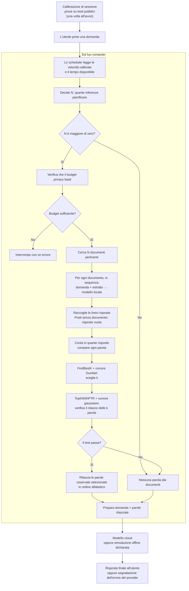

# Schema a blocchi del sistema

Il diagramma descrive il funzionamento attuale della modalità adattiva. **N** è il numero di inferenze locali pianificate; **k** è il numero di parole proposte al filtro. La calibrazione automatica delle velocità è implementata e attivata di default all'avvio della sessione.

## Come leggere il percorso

1. **La domanda avvia il lavoro.** I documenti provengono dai percorsi locali esplicitamente indicati oppure dal benchmark previsto. Il programma non cerca liberamente nei file personali.
2. **Lo scheduler sceglie N prima della ricerca.** Stima quante inferenze entrano nel tempo rimasto dopo aver riservato il tempo di rete e cloud. Normalmente sceglie fra 5 e 40; se non entra il minimo, oggi sceglie zero. Le velocità sono misurate dalla calibrazione all'avvio della sessione, oppure impostate manualmente con `--no-calibration`.
3. **Il modello locale lavora su un documento alla volta.** Riceve sempre la domanda, insieme a un estratto del documento. Non vengono creati voti duplicando lo stesso documento; eventuali posti mancanti restano vuoti.
4. **Si contano le parole delle risposte.** Una parola contribuisce al massimo una volta per risposta, anche se vi compare più volte.
5. **FindBestK sceglie quante parole proporre.** Guarda i distacchi fra conteggi consecutivi e aggiunge rumore Gumbel alla scelta. Il dominio predefinito di k è da 1 a 10.
6. **TopKWithPTR decide se rilasciarle.** Usa un test con rumore gaussiano. Se fallisce non escono parole dal filtro. Anche un tentativo senza rilascio consuma budget privacy; le richieste ripetute sullo stesso corpus devono condividere la contabilizzazione.
7. **Il cloud costruisce la risposta finale.** Riceve la domanda e le parole rilasciate, non gli estratti o le bozze locali. Senza parole, oggi risponde con conoscenza generale. La simulazione offline non produce una risposta di cui valutare la qualità.

## Limiti e priorità

La scelta di N viene effettuata una volta prima delle inferenze, non aggiornata continuamente durante il lavoro. La calibrazione automatica iniziale con prove pubbliche è implementata: misura le velocità del modello su testi pubblici a lunghezze rappresentative (256, 512, 1024 token) una volta per sessione. Il tempo di calibrazione è riportato separatamente dal tempo delle singole richieste.

Lo SLA è un obiettivo flessibile: gli sforamenti occasionali vanno misurati. Privacy e utilità delle risposte hanno la precedenza. Per questo va riesaminata la scelta attuale di rinunciare ai documenti quando il tempo stimato non basta; il diagramma mostra il comportamento esistente, non anticipa quella modifica.

Il test di privacy non garantisce che la risposta sia corretta o utile. Non promette neppure rischio zero: la garanzia è quella del meccanismo, della contabilizzazione e delle ipotesi in `poc/docs/PRIVACY_ACCOUNTING.md`.

Il confine mostrato riguarda il provider della risposta finale. Report e telemetria sono diagnostica sperimentale distinta: la cattura completa autorizzata può includere dati sensibili e non è coperta dalla garanzia DP del rilascio.

Il dettaglio dei passaggi è in `pseudocodice.md`; il riferimento tecnico del percorso è `poc/ARCHITECTURE.md`.

